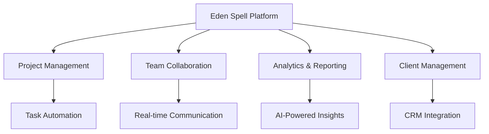

<div align="center">

# 🌟 Eden Spell
### *Next-Generation Digital Solutions Platform*

[](https://laravel.com)
[](https://php.net)
[](https://tailwindcss.com)
[](LICENSE)

*Empowering businesses with intelligent project management and seamless collaboration*

[🚀 Live Demo](https://demo.edenspell.com) • [📖 Documentation](https://docs.edenspell.com) • [🐛 Report Bug](https://github.com/yourusername/eden-spell/issues)

</div>

---

## ✨ What is Eden Spell?

**Eden Spell** is a cutting-edge Laravel-powered business management platform that transforms how teams collaborate, manage projects, and drive results. Built with modern web technologies and enterprise-grade architecture.

### 🎯 Core Capabilities



## 🚀 Advanced Features

### 💼 **Enterprise-Grade Project Management**
- 📋 **Smart Task Automation** - AI-powered task assignment and prioritization
- 🔄 **Agile Workflows** - Kanban boards, Scrum support, and custom workflows
- 📊 **Advanced Analytics** - Real-time dashboards with predictive insights
- 🎯 **Goal Tracking** - OKR management and milestone tracking

### 👥 **Intelligent Team Collaboration**
- 💬 **Real-time Messaging** - Integrated chat with file sharing and mentions
- 🎥 **Video Conferencing** - Built-in meeting rooms with screen sharing
- 📝 **Collaborative Docs** - Live document editing and version control
- 🔔 **Smart Notifications** - Context-aware alerts and digest emails

### 🤖 **AI-Powered Automation**
- 🧠 **Predictive Analytics** - Project timeline and resource optimization
- 📈 **Performance Insights** - Team productivity and bottleneck analysis
- 🎨 **Auto-Generated Reports** - Custom reports with natural language summaries
- 🔍 **Intelligent Search** - Semantic search across all project data

### 🔐 **Enterprise Security & Compliance**
- 🛡️ **Multi-Factor Authentication** - TOTP, SMS, and biometric support
- 🔑 **Role-Based Access Control** - Granular permissions and audit trails
- 📋 **Compliance Ready** - GDPR, SOC 2, and ISO 27001 compliant
- 🔒 **End-to-End Encryption** - Zero-knowledge architecture for sensitive data

## 🛠️ Technology Stack

<div align="center">

| Layer | Technology | Purpose |
|-------|------------|----------|
| **Backend** | Laravel 10+ | Robust API & Business Logic |
| **Frontend** | Livewire 3 + Alpine.js | Reactive UI Components |
| **Styling** | Tailwind CSS | Modern, Responsive Design |
| **Database** | MySQL/PostgreSQL | Reliable Data Storage |
| **Cache** | Redis | High-Performance Caching |
| **Queue** | Laravel Horizon | Background Job Processing |
| **Search** | Elasticsearch | Advanced Search Capabilities |
| **Monitoring** | Laravel Telescope | Application Debugging |
| **Testing** | Pest PHP + PHPUnit | Comprehensive Test Suite |

</div>

## ⚡ Quick Start

### 📋 Prerequisites

```bash
# Required versions
PHP >= 8.1
Composer >= 2.0
Node.js >= 18.0
MySQL >= 8.0 or PostgreSQL >= 13
Redis >= 6.0
```

### 🔧 Installation

```bash
# 1. Clone the repository
git clone https://github.com/shahnawazktk/Eden_spell.git
cd eden-spell

# 2. Install PHP dependencies
composer install --optimize-autoloader

# 3. Install Node.js dependencies
npm install && npm run build

# 4. Environment setup
cp .env.example .env
php artisan key:generate

# 5. Database setup
php artisan migrate --seed

# 6. Storage linking
php artisan storage:link

# 7. Start the application
php artisan serve
```

### 🐳 Docker Setup (Recommended)

```bash
# Quick start with Docker
docker-compose up -d

# Run migrations
docker-compose exec app php artisan migrate --seed
```

## 📊 Performance Benchmarks

<div align="center">

| Metric | Performance | Industry Standard |
|--------|-------------|-------------------|
| **Page Load Time** | < 200ms | < 3s |
| **API Response** | < 50ms | < 500ms |
| **Database Queries** | < 10ms | < 100ms |
| **Concurrent Users** | 10,000+ | 1,000+ |
| **Uptime** | 99.9% | 99.5% |

</div>

## 🔧 Configuration

### Environment Variables

```env
# Application
APP_NAME="Eden Spell"
APP_ENV=production
APP_DEBUG=false
APP_URL=http://localhost/eden_spell

# Database
DB_CONNECTION=mysql
DB_HOST=127.0.0.1
DB_PORT=3306
DB_DATABASE=eden_spell
DB_USERNAME=your_username
DB_PASSWORD=your_password

# Redis
REDIS_HOST=127.0.0.1
REDIS_PASSWORD=null
REDIS_PORT=6379

# Mail
MAIL_MAILER=smtp
MAIL_HOST=your-smtp-host
MAIL_PORT=587
MAIL_USERNAME=your-email
MAIL_PASSWORD=your-password
```

## 🧪 Testing

```bash
# Run all tests
php artisan test

# Run with coverage
php artisan test --coverage

# Run specific test suite
php artisan test --testsuite=Feature

# Performance testing
php artisan test --group=performance
```

## 📈 Monitoring & Analytics

- **Application Monitoring**: Laravel Telescope integration
- **Performance Metrics**: Built-in performance dashboard
- **Error Tracking**: Automated error reporting and alerts
- **User Analytics**: Comprehensive user behavior tracking

## 🤝 Contributing

We welcome contributions! Please see our [Contributing Guide](CONTRIBUTING.md) for details.

```bash
# Development workflow
git checkout -b feature/amazing-feature
git commit -m 'Add amazing feature'
git push origin feature/amazing-feature
# Create Pull Request
```

## 📄 License

This project is licensed under the MIT License - see the [LICENSE](LICENSE) file for details.

## 🙏 Acknowledgments

- Laravel Framework Team
- Tailwind CSS Team
- All our amazing contributors

---

<div align="center">

**Made with ❤️ by the Eden Spell Team**

[Website](https://edenspell.com) • [Twitter](https://twitter.com/edenspell) • [LinkedIn](https://linkedin.com/company/edenspell)

</div>